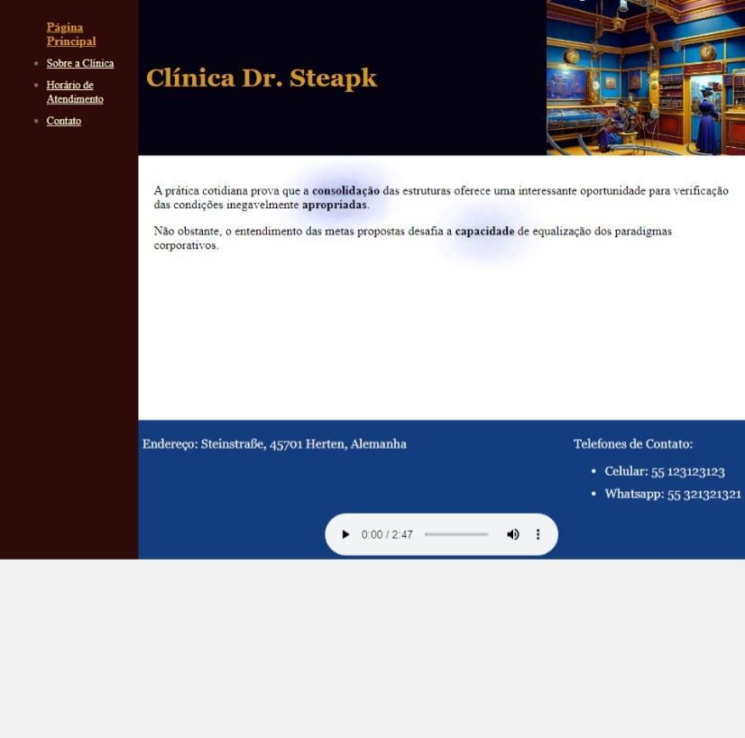
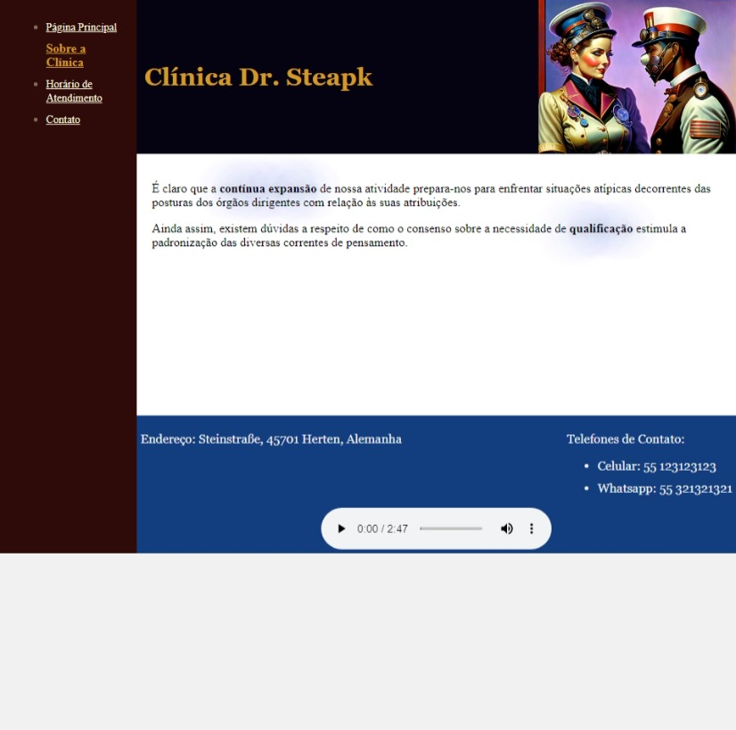
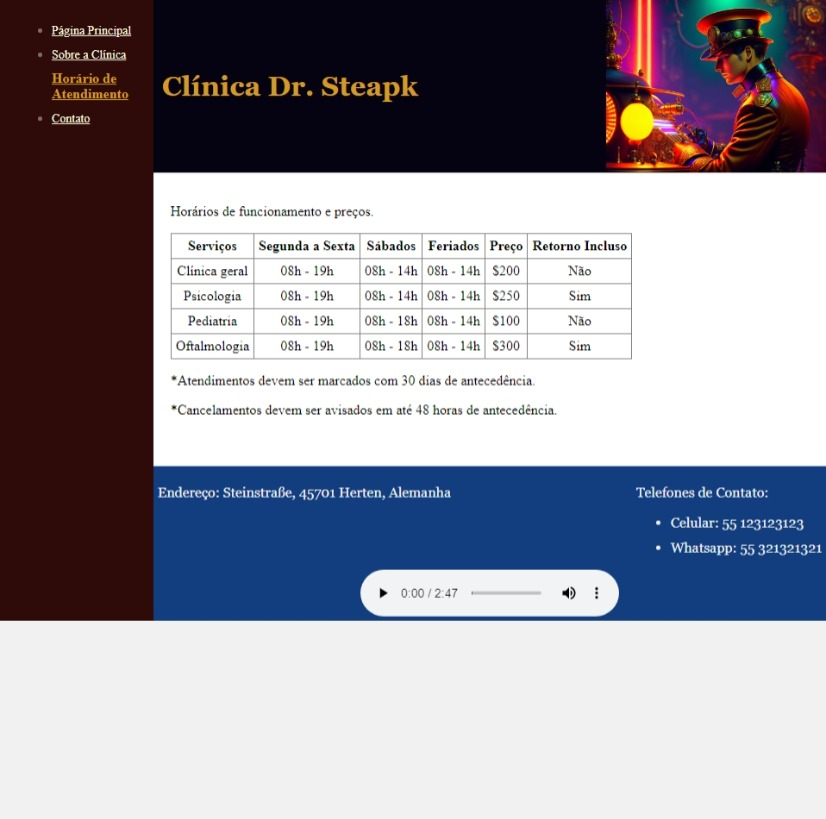
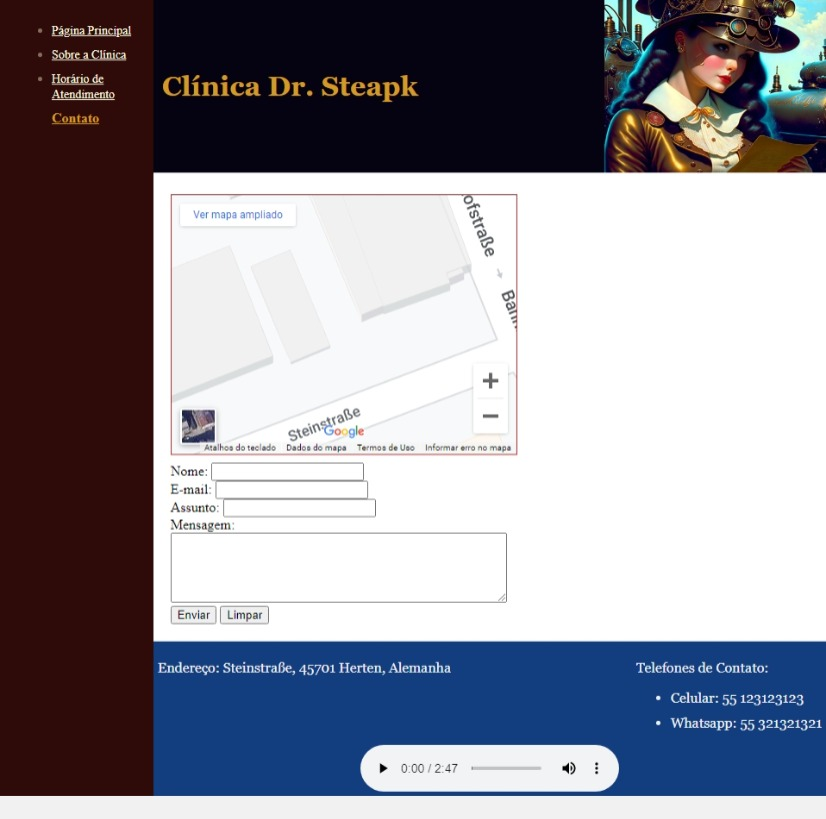

# Criando seu Primeiro Site Completo com HTML

- [Requisitos](https://github.com/digitalinnovationone/trilha-html-modulo-2)
- Aúdio utilizado: [Fabi Cruz - Atoms](https://www.palcomp3.com.br/fabicruz/atoms/)
- Prints:

